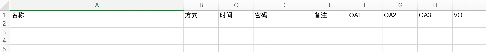
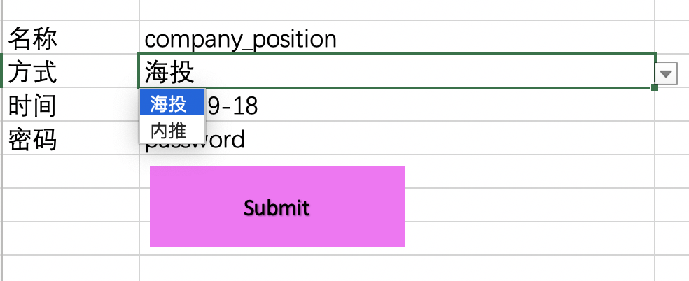
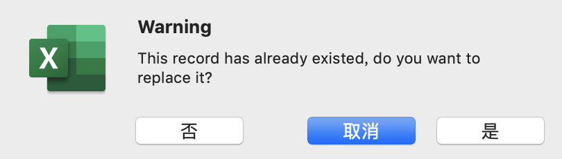

# 简历投递记录器
## 1. 将公司职位、投递方式、时间等信息插入sheet1，免去找空行的烦恼
## 2. 无按名称排序功能，如需排序请使用Excel自带功能，注意列的范围
## 3. 安全无毒，请允许运行宏
## 4. “方式”为下拉菜单； “时间”是自动获取，转换成了string格式，方便您的旧记录转移
## 5. 如果弹出Warning提示，说明已经有相同“名称”字段，“NO”为插入新的一条记录，“YES”为替换旧的记录

